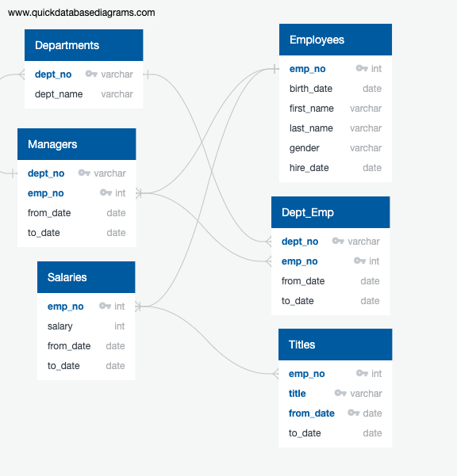

# Pewlett-Hackard-Analysis

---
## Overview 

This project looks to determine the number of retiring employees per title, and identify employees who are eligible to participate in a mentorship programme. The paper will begin with an analysis and results of the data retrival, including removing duplicated rows and writing script to obtain the correct information from the data. It will then go on to analyse which employees are eligible to participate in a mentorship programme, and provide a table with the results. 

### Aim 

The aim of the paper is to retrieve:
  1. The Number of Retiring Employees by Title
  2. The Employees Eligible for the Mentorship Programme

---
## Analysis and Results 

In order to understand the relationships between the tables, and help assign primary and forgein keys, it's helpful to create an Entity Relationship Database(ERD) on Quick Database Diagrams (QDD). 

<br />
<p align="center">

</p>
<p align="center">
Employee ERD
</p>
<br />

### Retirement Titles 

The first step in retrieving the number of employees retiring is to retrieve all employees with a birthday between 1952 and 1955. A new table can be created by joining data columns from two other tables, first_name and last_name from the Employees table, and title, from_date and to_date from the Titles table. 

``` sql
SELECT  employees.emp_no,
		employees.first_name,
		employees.last_name,
		titles.title,
		titles.from_date,
		titles.to_date
INTO retirement_titles
FROM employees
FULL OUTER JOIN  titles
ON (employees.emp_no = titles.emp_no)
WHERE (employees.birth_date BETWEEN '1952-01-01' AND '1955-12-31')
ORDER BY employees.emp_no;
```

Using the code above, a table is created with 133,776 rows.

### Unique Titles 

There are duplicate entries for some employees because they have switched titles over the years, so these duplicates need to be removed and keep only the most recent title of each employee.

``` sql
SELECT DISTINCT ON (emp_no) emp_no,
first_name,
last_name,
title,
from_date,
to_date
INTO unique_titles
FROM retirement_titles
WHERE (to_date = '9999-01-01')
ORDER BY emp_no, title DESC;
```

Using a DISTINCT ON statement to retrieve the first occurrence of the employee number for each set of rows, and a WHERE statement to keep only those dates that are equal to 01/01/1999, a table can be created to display all the unique values of employees that are set to retire. 

The table is now pulling back 72,458 rows. 

### Retiring Titles 

Using the table created above, and the GROUP BY statement, another table can be created to show the number of employees that are due to retire by job title. 

``` sql
SELECT COUNT(unique_titles.emp_no), unique_titles.title
INTO retiring_titles
FROM unique_titles
GROUP BY unique_titles.title
ORDER BY COUNT DESC;
```
<br />
<p align="center">

</p>
<p align="center">
Retiring Count by Titles
</p>
<br />

This shows the 72,458 employees that are due to retire, broken up by titles. The role with the largest number of employees due to retire are senior engineers, with 25,916 people due to retire, and the role with the least number of employees due to retire are managers, with just 2 emloyees. 

### Mentorship Eligibility 

The second aim of this paper is to retrieve the employees who are eligible for the mentorship programme. 

``` sql 
SELECT DISTINCT ON (employees.emp_no) employees.emp_no,
	employees.first_name,
	employees.last_name,
	employees.birth_date,
	dept_emp.from_date,
	dept_emp.to_date,
	titles.title
INTO mentorship_eligibity
FROM employees
INNER JOIN dept_emp
ON (employees.emp_no = dept_emp.emp_no)
INNER JOIN titles
ON (employees.emp_no = titles.emp_no)
WHERE (employees.birth_date BETWEEN '1965-01-01' AND '1965-12-31')
ORDER BY employees.emp_no;
```
Here we created a new table called mentorship_eligibilty by using the DISTINCT ON function from the data retrieved from three other tables. It can be determined from the code above that there are 1940 employees who are eligible for the mentorship programme. 

---
## Summary 

In conclusion, it can be determined that:
1. There are 72,458 employees due to retire
2. There are 1,940 employees that are eligible for the mentoriship programme. 

In addition to finding out which employees are eligible for the mentorship programme, it would helpful to find out how many employees from each job role are eligible. This would be beneficial in helping distribute mentors to the correct department, as well as finding out whether support is needed in other areas. 

``` sql 
SELECT COUNT(mentorship_eligibity.emp_no), mentorship_eligibity.title
INTO mentorship_titles
FROM mentorship_eligibity
GROUP BY mentorship_eligibity.title
ORDER BY COUNT DESC;
```
<br />
<p align="center">

</p>
<p align="center">
Employee Mentorship Programme Eligibility by Titles
</p>
<br />

Using the code above, it is determined the job role with the largest number of emloyees eligible for this programme is Senior Staff, with 633 employees. This is in comparrison to Technique Leaders, who have the smalled number of employees eligible with 99 employees. 
